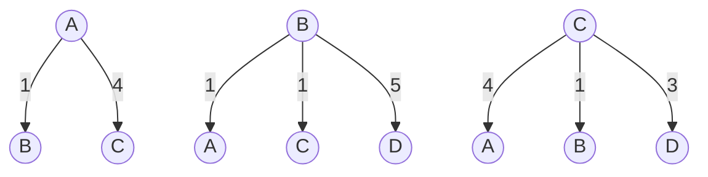
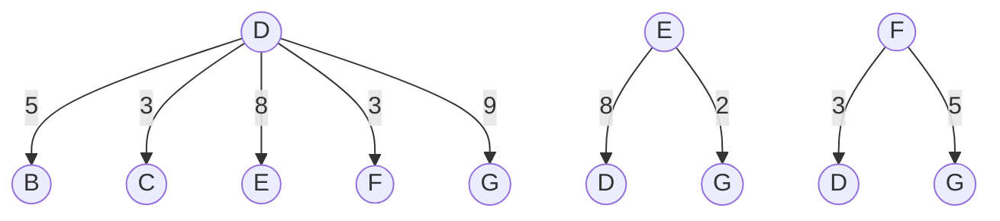
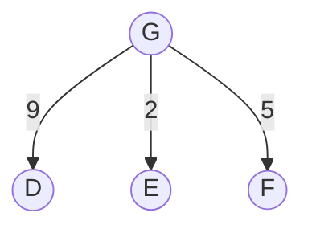

# Exercice 1

By: Higor Ferreira Alves Santos

---

Consider the state space graph shown above. A is the start state and G is the goal state. The costs for each edge are shown on the graph. Each edge can be traversed in both directions. Note that the heuristic h1 is consistent but the heuristic h2​ is not consistent.

**(a) Possible paths returned**

For each of the following graph search strategies (_do not answer for tree search_), mark which, if any, of the listed paths it could return. Note that for some search strategies the specific path returned might depend on tie-breaking behavior. In any such cases, make sure to mark _all_ paths that could be returned under some tie-breaking scheme.

| Search Algorithm                 | A-B-D-G | A-C-D-G | A-B-C-D-F-G |
| -------------------------------- | ------- | ------- | ----------- |
| Depth first search               |         |         | X           |
| Breadth first search             |         | X       |             |
| Uniform cost search              |         |         | X           |
| A\* search with heuristic \(h1\) |         | X       |             |
| A\* search with heuristic \(h2\) |         | X       |             |

### Nós de árvore

